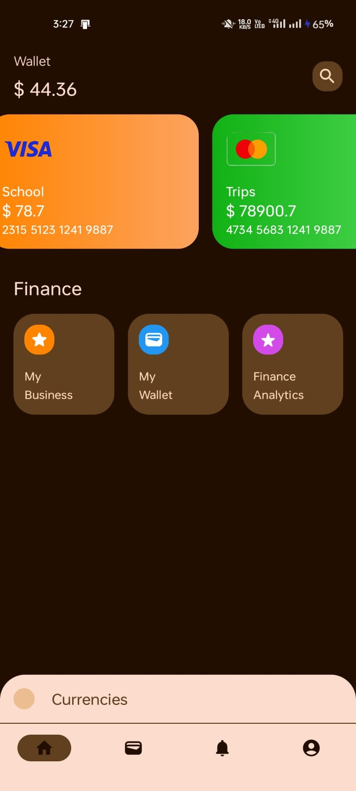
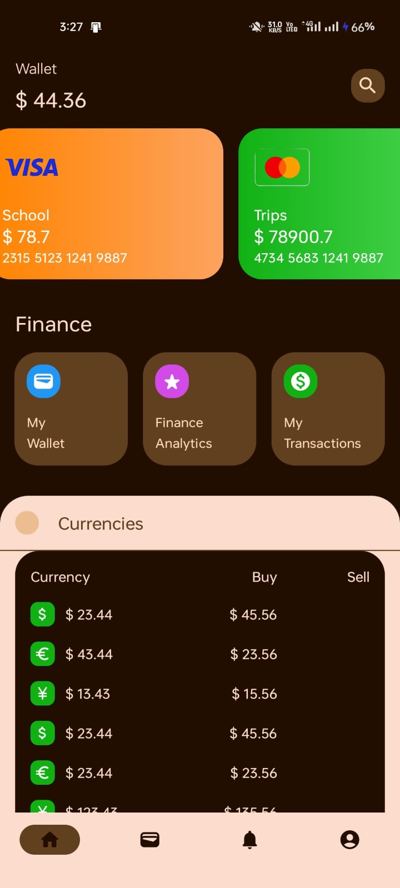
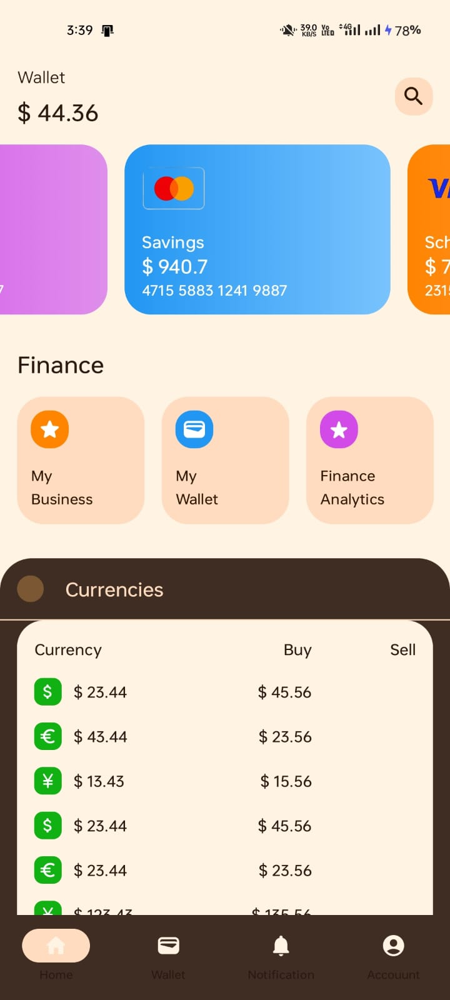

# 💳 PaySphere
### A Modern Digital Wallet UI built with Kotlin and Jetpack Compose
> Smart Wallet for a Smarter Finance

# 📌 Overview

 Smarter finance management with a modern digital wallet experience.
 Built using Kotlin, Jetpack Compose, featuring virtual cards, a finance dashboard, and a currency tracker designed with Material Design 3.

# ✨ Features

- 📊 **Interactive Wallet Dashboard**
  - Displays total wallet balance
  - Clean search interface

- 💳 **Virtual Card Carousel**
  - Beautiful gradient-styled debit/credit cards
  - VISA and MasterCard UI mockups
  - Card balance and number display

- ⚡ **Finance Quick Actions**
  
  - My Business
  - My Wallet
  - Finance Analytics
  - My Transactions

- 🌍 **Currency Tracker**
  - Collapsible animated currency section
  - Displays Buy/Sell rates
  - Supports USD, EUR, and YEN

- 🧭 **Modern Navigation**
  - Bottom Navigation Bar
  - Home
  - Wallet
  - Notifications
  - Account

- 🌗 **Dynamic Theming**
  - Light Mode
  - Dark Mode
  - Built using Material Design 3 theming

---

## 📱 App Screenshots

| Home Screen | Currency Tracker | Currency List |Light Theme
|-------------|------------------|---------------|---------------|
|  |  |  ||

---

# 🛠️ Tech Stack

**Language**
- Kotlin

**UI Toolkit**
- Jetpack Compose

**Design System**
- Material Design 3

**Libraries**
- Material Icons Extended
- Accompanist System UI Controller

**Build Tool**
- Gradle (Kotlin DSL)

---

# 🧱 Architecture

PaySphere follows a **modern Android development approach**:

- Declarative UI with **Jetpack Compose**
- Modular **Composable Components**
- State-driven UI updates
- Clean UI separation

---

# 📂 Project UI Structure
---------------------------------
The app's UI is broken down into modular, reusable Compose functions located in `app/src/main/java/com/example/paysphere/ui/theme/`:

~~~
app/
┣ ui/
┃ ┣ theme/
┃ ┃ ┣ WalletSection.kt
┃ ┃ ┣ CardSection.kt
┃ ┃ ┣ FinanceSection.kt
┃ ┃ ┣ CurrencySection.kt
┃ ┃ ┗ BottomNavigationBar.kt
┣ MainActivity.kt
┗ build.gradle
~~~

* `WalletSection.kt`: Header section displaying balance and search.
* `CardSection.kt`: Horizontal pager for credit/debit cards.
* `FinanceSection.kt`: Action buttons for app features.
* `CurrencySection.kt`: Expandable list of live currency rates.
* `BottomNavigationBar.kt`: App-wide bottom navigation.

---

# 🚀 Getting Started

## Prerequisites

- Android Studio (Latest Version Recommended)
- Minimum SDK: 24 (Android 7.0)
- Target SDK: 36

---

## Installation

Clone the repository
~~~
git clone https://github.com/Rohitkumarpradhan/PaySphere.git
~~~
# 🔮 Future Improvements
------------------------------------------------

- 🔗 Real-time currency API integration

- 💾 Transaction history with Room Database

- 🔐 Authentication system (Firebase / Google Sign-In)

- 💸 Payment simulation system

- 🎞️ Advanced animations using Motion Compose

- 🤝 Contributing
  
Contributions are welcome!

# Fork the repository
------------------------------

Create a new branch
~~~
git checkout -b feature-name
~~~

Commit your changes

~~~
git commit -m "Added new feature"
~~~
Push to the branch

~~~
git push origin feature-name
~~~

Open a Pull Request

----------------------------------

Built with ❤️ using Kotlin and Jetpack Compose.

If you found this project useful
---------------------------------

consider giving it a ⭐ !
